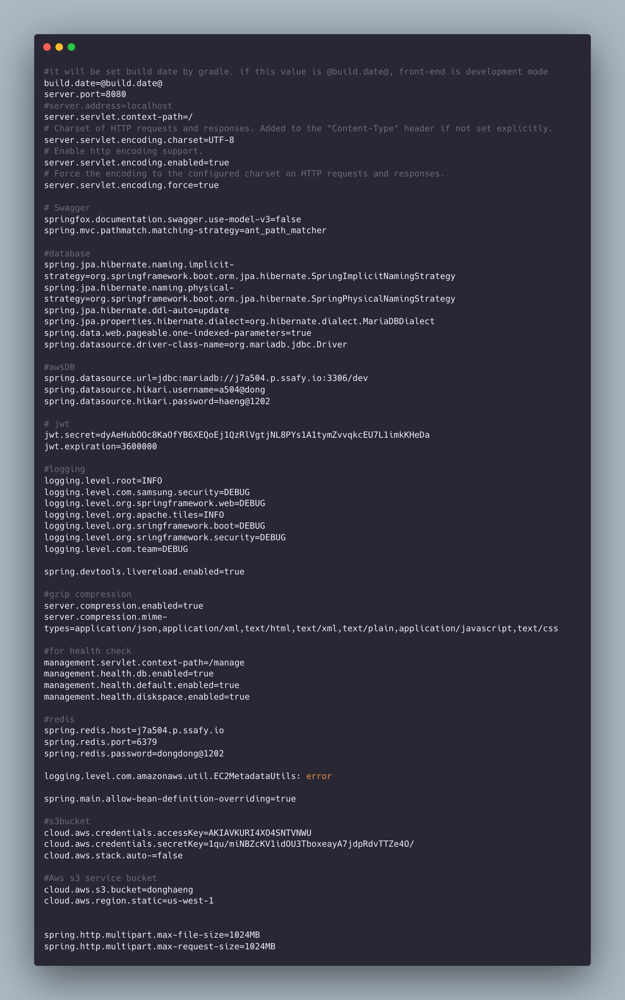

# 배포 문서

## 설치 환경
```shell
OS : Ubuntu 20.04
IDE : Intellij 
	  vscode
node : 14.17.0
jdk : 11
MariaDB : 10.6
Docker version : 20.10.18
jenkins : lts
python : 3.9.14

```

## port 
```shell
FrontEnd: 80
BackEnd: 8080
MariaDB: 3306
Django : 9999
Jenkins: 8085
Redis : 6379
```


# 1. Docker 설치

## 1) 필요한 util 설치
``` bash
sudo apt-get update
sudo apt-get upgrate
sudo apt-get install \
	apt-transport-https \
	ca-certificates \
	curl \
	gnupg \
	lsb-release
```


## 2) curl을 통한 docker 설치 & apt 기능 추가
```bash
curl -fsSL https://download.docker.com/linux/ubuntu/gpg | sudo apt-key add - 

sudo add-apt-repository "deb [arch=amd64] https://download.docker.com/linux/ubuntu bionic stable"

sudo apt-get update
```

## 3) docker 설치 및 설정

```bash
sudo apt-get install docker-ce docker-ce-cli containerd.io

sudo curl -L "https://github.com/docker/compose/releases/download/1.29.2/docker-compose-$(uname -s)-$(uname -m)" -o /usr/local/bin/docker-compose

sudo chmod +x /usr/local/bin/docker-compose

sudo chmod 666 /var/run/docker.sock

# 설치 되어있는지 확인 유무는
docker --version
docker-compose --version
```

# 2. Jenkins 설치

## 4) docker local volume create
``` bash
docekr  volume create {볼륨 이름}
# docker volume create jenkins
# docker volume create mariadb

docker volume ls 
#로 확인

docker volume inspect {}
# inspect 명령어를 사용하여 세부 정보 확인
#docker volume

docker image pull {이미지이름 : 이미지 이름 : 버전}
#docker image pull jenkins/jenkins:lts
```

## 5) jenkins docker 실행
```bash
docker run --name {container 이름} -p {내가 노출하고자 하는 포트(웹으로 접속)}:8080 -p {java api 포트 주로 그대로 가져가는 듯?(50000)으로}:50000 -d -v /var/run/docker.sock:/var/run/docker.sock -v {jenkins 볼륨 이름}:{실질적으로 jenkins 볼륨이 저장될 위치} -u root jenkins/jenkins:lts

## 실제 예시 0831에 추가해야지
# sudo docker run -d -p 8085:8080 -p 50000:50000 -v /var/run/docker.sock:/var/run/docker.sock  -v jenkins:/var/jenkins_home -v /homw/ubuntu/.ssh:/root/.ssh --name jenkins -e TZ=Asia/Seoul jenkins/jenkins:lts
```
순서대로 설명을 하면  docker run 은 도커를 실행하는 명령어 이고
- --name : container 이름 을 위한 옵션
- -p : 현재 내 컴퓨터의 port(외부에서 접속 가능한) 와 docker 의 port 연결 (host port) :(container port)
- -d : container를 백그라운드 에서 유지
- -u : user 가 누구인지
- -v : voluem 연결 -> 만약 volume create 하지 않고 생성하는 경우 임의로 생성된 이름들을 갖게 됨

## 6) jekins container 내 설정

###  들어가기 전에 jenkins내에서 docker 에 대해 접근이 가능해야하여 아래와 같은 설정을 진행하였음.

$USER 부분은 각자의 계정명을 넣으면 된다.

```bash
sudo chmod 666 /var/run/docker.sock
sudo usermod -aG docker $USER
```

1. 젠킨스 접근 방법 
```bash
docker exec -it {contianer 이름} /bin/bash
docker exec -it -u root {container 이름} /bin/bash
```

2. 젠킨스 초기 비밀번호 확인은 => 보통 젠킨스 처음 접근할때 뜨는 페이지에서 입력
```
cat /var/jenkins_home/secrets/initialAdminPassword
```

3. 젠킨스 컨테이너에서 host(jenkins 가 설치된 pc) 의 도커를 사용할 수 있게 설치

- x86 64bit


>
```bash
apt-get update && \
apt-get upgrade && \
apt-get -y install apt-transport-https \
     ca-certificates \
     curl \
     gnupg2 \
     software-properties-common && \
curl -fsSL https://download.docker.com/linux/$(. /etc/os-release; echo "$ID")/gpg > /tmp/dkey; apt-key add /tmp/dkey && \
add-apt-repository \
   "deb [arch=amd64] https://download.docker.com/linux/$(. /etc/os-release; echo "$ID") \
   $(lsb_release -cs) \
   stable" && \
apt-get update && \
apt-get -y install docker-ce
````


- ARM 64bit

>apt-get update && \
apt-get upgrade && \
apt-get -y install apt-transport-https \
     ca-certificates \
     curl \
     gnupg2 \
     software-properties-common && \
curl -fsSL https://download.docker.com/linux/$(. /etc/os-release; echo "$ID")/gpg > /tmp/dkey; apt-key add /tmp/dkey && \
add-apt-repository \
   "deb [arch=arm64] https://download.docker.com/linux/$(. /etc/os-release; echo "$ID") \
   $(lsb_release -cs) \
   stable" && \
apt-get update && \
apt-get -y install docker-ce


## 7) 젠킨스 접속한 설정

### 1). 플러그인

이렇게 완료를 했으면 젠키스에 접속하여 설정을 진행한다.
-> 기본적으로 recommand로 진행하여 설치하였다.


젠킨스에 접속하여 플러그인 관리쪽으로 가서  필요한 플러그인들을 설치한다.
일단 난 docker & git & gitlab 과 관련된 플러그인들은 거의다 설치 했다.
- git
	- git clinet, git plugin, github api plugin, github branch soruce plugin, gitlab api plugin, gitlab api plugin, gitlab authentication plugin


### 2). 젠킨스 아이템 설정

그후
 jenkins 새 아이템 생성을 하여 진행을 한다.

### 2-1).소스 코드 관리는 git으로 하고,


Repository URL 은 HTTPS 접근으로 복사 하여야 한다. = 빨간색 동그라미 클릭 


그리고 주소를 복사하고 credentials 를 클릭하여 아래와 같이 완성을 한다.
ssh 접근을 사용한다면 좀 다른 방식으로 되겠지만 
현재는 깃랩 id/ pw로 접근하는 설정이니 아래와 같이 완성작성하고 add를 누르고 방금전 생성한 계정으로 credentials를 설정해주면 gitlab 주소에 빨간 줄로 뜨는 에러가 사라진다.


Branches to build는 내가 원하는 branch 에서 push 이벤트가 발생할때 하게 끔 설정할 수 있다.

### 2-2). web hook 설정을 위한 jenkins 설정
web hook 연결을 위해서

아래의 빌드 유발에서 URL 을 복사해두고, 고급을 클릭해서 나머지는 default 그대로 두고, secret token에서 generate 해서 내용을 복사해둔다.


### 3. 배포를 위한 build step
그리고 build steps 에서 Add build step 


클릭하여 내가 원하는 커멘드를 써주면 된다.
아래의 내용은 exec shell에 들어가는 내용과 각각의 코드 폴더에 최상단 내에존재하는 Dockerfile 내용이다.


- java


```bash
cd {spring 이 있는 폴더}
chmod +x gradlew
./gradlew build
docker login -u {dockerhub 계정} -p {docker 비밀번호}
docker build -t {dockerhub 계정}/{이미지}:{버전} .
docker push  {dockerhub 계정}/{이미지}:{버전}
docker stop {컨테이너 이름} && docker rm {컨테이너 이름}
docker run -d -p {밖에 노출되는 포트}:8080 --name {컨테이너 이름} {dockerhub 계정}/{이미지}:{버전}
```


Dockerfile


```bash
# Start with a base image containing Java runtime
FROM openjdk:{자바 버전}
# Add Author info
# 임시로 minseo의 이메일 저장
LABEL maintainer="test@test.com"
# Add a volume to /tmp
VOLUME /tmp
# Make port 8080 available to the world outside this container
EXPOSE 8080
# The application's jar file
ARG JAR_FILE=./build/libs/DongHang-0.0.1-SNAPSHOT.jar//
# Add the application's jar to the container
COPY ${JAR_FILE} a504.jar
# Run the jar file
ENTRYPOINT ["java","-jar","/a504.jar"]
```


- react


``` bash
cd {react파일이 있는 폴더}
docker login -u {dockerhub 계정} -p {docker 비밀번호}
docker build -t {dockerhub 계정}/{이미지}:{버전} .
docker push  {dockerhub 계정}/{이미지}:{버전}
docker stop {컨테이너 이름} && docker rm {컨테이너 이름}
docker run -d -p {밖에 노출되는 포트}:80 --name {컨테이너 이름} {dockerhub 계정}/{이미지}:{버전}

```


Dockerfile

```bash
FROM node:latest as builder
# 작업 폴더를 만들고 npm 설치
RUN mkdir /usr/src/app
WORKDIR /usr/src/app
ENV PATH /usr/src/app/node_modules/.bin:$PATH
COPY package.json /usr/src/app/package.json
RUN npm install  --force
# force로 설정한 이유 : react 버전 18 로 처리를 해야하는데, 문제가 발생하여 강제처리를 하기 위해서
# 소스를 작업폴더로 복사하고 빌드
COPY . /usr/src/app
RUN npm run build
FROM nginx:latest
# nginx의 기본 설정을 삭제하고 앱에서 설정한 파일을 복사
RUN rm -rf /etc/nginx/conf.d
COPY conf /etc/nginx
# 위에서 생성한 앱의 빌드산출물을 nginx의 샘플 앱이 사용하던 폴더로 이동
COPY --from=builder /usr/src/app/build /usr/share/nginx/html
# 80포트 오픈하고 nginx 실행
EXPOSE 80
CMD ["nginx", "-g", "daemon off;"]

```


- django

``` bash
cd {django 파일이 있는 폴더}
docker login -u {dockerhub 계정} -p {docker 비밀번호}
docker build -t {dockerhub 계정}/{이미지}:{버전} .
docker push  {dockerhub 계정}/{이미지}:{버전}
docker stop {컨테이너 이름} && docker rm {컨테이너 이름}
docker run -d -p {밖에 노출되는 포트}:80 --name {컨테이너 이름} {dockerhub 계정}/{이미지}:{버전}

```

Dockerfile

```bash
FROM python:3.9.13 
#내가 원하는 파이썬 버전
LABEL maintainer="test@test.com"

RUN pip install --upgrade pip
# pip 설치
WORKDIR /usr/src/app
# /usr/src/app 이라는 디렉토리 생성
COPY . .
# 현재 폴더 내용을 복사
WORKDIR ./donghang
#manage.py를 실행할 수 있는 디렉토리로 이동합니다.
RUN  pip install -r requirements.txt
# 내 장고 설정들을 저장한 requirements.txt
# pip freeze > requirements.txt 로 추출
# manage.py와 같은 위치에 둔다.
CMD ["python3", "manage.py", "runserver", "0.0.0.0:8080"]
#이동한 디렉토리에서 django를 가동시켜주는 코드를 작성합니다. 여기서 port는 8000로 실행시키겠습니다.
EXPOSE 8080
```


## 4. webhook을 위한 gitlab 설정


작업을 마치면 저장을 한후, git lab 페이지로 돌아와 webhook을 작성해준다.


위에 보이는 웹훅을 클릭해서 들어가서 아까 복사해둔 URL 과 token을 여기에 저장을한다.


trigger에서 push 이벤트가 발생했을때를 클릭하여 원하는 브랜치를 설정한다.
아까 위에서 설정한 브랜치와 **동일한 이름** 이어야 한다. 


아래로 내려와 test push event설정후 200이 뜬다면 save changes 를 하면 끝이 난다.


------

## Issue

1.  젠킨스에서 빌드 시 아래와 같은 권한 에러 발생
    
    🚨 Got permission denied while trying to connect to the Docker daemon socket at [unix:///var/run/docker.sock](unix:/var/run/docker.sock): Get "[http://%2Fvar%2Frun%2Fdocker.sock/v1.24/containers/json](http://%252Fvar%252Frun%252Fdocker.sock/v1.24/containers/json)": dial unix /var/run/docker.sock: connect: permission denied
    1.  원인 : 빌드시 동작하는 “jenkins” 유저의 권한 문제
    2.  해결 방법
        1.  젠킨스 컨테이너에 root 유저로 접속하여 /var/run/docker.sock의 권한 부여
            1.  호스트에서 젠킨스 컨테이너로 접속 `docker exec -it -u root jenkins /bin/bash`
            2.  젠킨스 컨테이너 안에서 권한 부여 `chmod 666 /var/run/docker.sock`
        2.  crontab 사용하여 부팅, 리붓 시 자동으로 /var/run/docker.sock의 권한 부여
            1.  호스트에서 크론탭 설정 `sudo crontab -e`
            2.  크론탭 맨아래 아래 추가후 리붓 `@reboot sudo chmod 666 /var/run/docker.sock`
2.  위와 같은 에러가 발생할 경우
    
    🚨 Got permission denied while trying to connect to the Docker daemon socket at [unix:///var/run/docker.sock](unix:/var/run/docker.sock): Get "[http://%2Fvar%2Frun%2Fdocker.sock/v1.24/containers/json](http://%252Fvar%252Frun%252Fdocker.sock/v1.24/containers/json)": dial unix /var/run/docker.sock: connect: permission denied
    1.  `sudo chmod 666 /var/run/docker.sock`


# 3. maria db 설정

## 3-1. mariadb docker 설정

```
docker volume create DB;
docker run -d -p 3306:3306 -e MYSQL_ROOT_PASSWORD={} -v DB:/var/lib/mysql --name mariadb mariadb:10.6

```

## 3-2.  mariadb data 자동 백업

참고한 블로그
https://jsmun.com/97

``` bash
# backup을 저장하기 위한 디렉토리 생성
sudo mkdir backup/
sudo mkdir backup/database

#스크립트
sudo vi /backup/DB.sh


#스크립트 내용
echo "============= 5일 지난 데이터 삭제 시작 ============="
# 5일이 지난건 지워버림
DEL_FILE=`date -d "-5 days" +%Y%m%d`


# 아래와 같이 작성한 이유는 나같은 경우는 crontab 을 2번하게 하였기 때문에
rm -rf /backup/database/*mysql_bak_dev_${DEL_FILE}*.sql
echo "============= 5일 지난 데이터 삭제 완료 ============="

echo "============= 변수 할당 시작 ============="
 DATE=`date +"%Y%m%d_%H%M"` # 나는 하루에 2번해서 구분하기 위해
 USER="{DB 접속계정}" # ex) USER="root"
 PASSWORD="{DB 계정의 비번}" # ex) PASSWORD="1234"
 DATABASE="{접속해야하는 database 이름}" # ex) DATABASE="data" 
 CONTAINER="{docker container 이름}" #ex) CONTAINER="mariadb"
 OUTPUT_PATH="/backup/database/mysql_bak_${DATABASE}_${DATE}.sql"
echo "============= 변수 할당 완료 ============="


echo "============= Database 백업 시작 ============="
 docker exec ${CONTAINER} /usr/bin/mysqldump -u${USER} -p${PASSWORD}  ${DATABASE} > ${OUTPUT_PATH}
 chown root.root  ${OUTPUT_PATH}
 chmod 755  ${OUTPUT_PATH}
echo "============= Database 백업 완료 ============="

# esc 누르고 :wq

#크론 잡 생성

#sudo crontab -e
```


``` bash
#맨아래에

{원하는 분 : 0~59} {내가 원하는 시 : 0~23} {원하는 일 : 1~31} {원하는 월 : 1~12} {원하는 요일 : 0~7}

#ex) 30 17 * * * bash /backup/DB.sh
#ex) 30 00 * * * bash /backup/DB.sh
# 뜻은 매일 오후 5시 반에 backup/DB.sh 을 실행해주세요.
# 뜻은 매일 오전 12시 반에 backup/DB.sh 을 실행해주세요.
# 그리고 ctrl + x 저장하고 싶으면 y를 누르고 저장되는 파일 이름을 확인 후 enter를 누르면 저장된다.  

#=> 이렇게 하는 이유
# GNN nano로 열어서...

service crond restart

# 반영결과 확인
crontab -l

#그리고 잘 동작하는지 확인을 진행함.
sudo sh /backup/DB.sh

#그리고 생성된 내용은
cat /backup/database/mysql_bak_dev_20220925_0723.sql 이렇게 해서 확인했다.
cat /{저장된 디렉토리들 루트서부터}/../../{실제 파일명}.sql

```

아래와 같이 잘 생성이 된걸 확인할 수 있다.


# 4. Redis 설정
```
docker run --name redis -d -p 6379:6379 -v redis:/data redis --requirepass "{비밀번호}""
```


# 번외

spring boot application-properties

